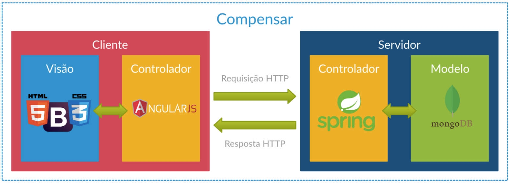
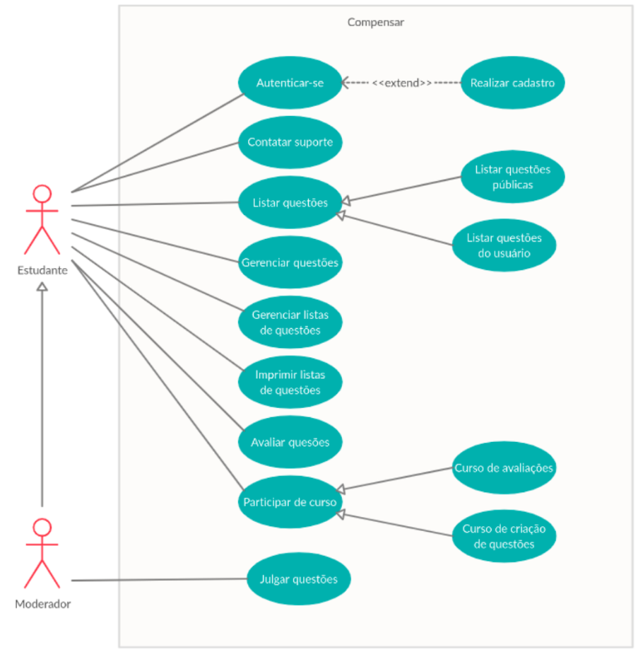

# 📚 ComPensar

**Ambiente de Estudo ao Pensamento Computacional 1.1**

**ComPensar** é uma plataforma voltada para auxiliar o ensino de **Pensamento Computacional (PC)** no contexto da educação básica, com foco na resolução de problemas matemáticos. O sistema oferece ferramentas que permitem a criação, avaliação e publicação de questões alinhadas com as competências do PC, promovendo o desenvolvimento do raciocínio lógico e da capacidade de abstração dos alunos.

O Pensamento Computacional é uma habilidade fundamental na educação moderna, pois facilita a aplicação de técnicas e conceitos computacionais para resolver problemas de diversas áreas, incluindo a matemática. Através do ComPensar, educadores podem avaliar o progresso dos alunos em competências essenciais como a decomposição de problemas, reconhecimento de padrões, abstração e criação de algoritmos.

## ⚙️ Tecnologias utilizadas

| Tecnologia                        | Versão  |
| --------------------------------- | ------- |
| [Node.js](https://nodejs.org/en/) | v22.2.0 |
| [Java](https://www.java.com/)     | v21     |
| Spring Boot                       | v3.3.3  |
| MongoDB                           | v7.0.2  |

## 🚀 Como levantar o projeto?

- **Clone o repositório:**

  ```bash
  git clone https://github.com/ufcg-lsd/compensar-legacy.git
  ```

### Frontend

1. **Instale as dependências:**

   ```bash
   cd frontend
   npm install
   ```

2. **Execute a aplicação:**

   ```bash
   npm start
   ```

### Backend

1. **Instale as dependências:**

   ```bash
   cd backend
   mvn clean install # Se os testes falharem e você queira rodar assim mesmo, adicione a flag -DskipTests
   ```

2. **Execute a aplicação:**

   ```bash
   mvn spring-boot:run
   ```

## 🛠️ Arquitetura

Abaixo está o diagrama da arquitetura geral da aplicação:



### Diagrama de Caso de Uso

O diagrama de caso de uso ilustra as interações entre os usuários e o sistema:



### 📚 Documentação Adicional

Para mais detalhes sobre a aplicação, como a listagem completa dos requisitos funcionais e não funcionais, acesse a pasta [**/docs**](./docs). Você pode explorar os seguintes conteúdos:

- [Listagem de Requisitos](./docs/requirements.md)


<!-- ## 🧪 Como testar

1. **Testes unitários:**

   ```bash
   npm test
   ```

2. **Cobertura de testes:**

   ```bash
   npm run coverage
   ```

3. **Testes end-to-end:**
   ```bash
   npm run e2e
   ``` -->

## 🏗️ Estrutura de pastas

```plaintext
├── frontend        # Diretório contendo o projeto AngularJS (Está pra ser reescrito em Next.JS em outro repositório)
├── backend         # Diretório contendo o projeto Spring
```

<!-- ## 📄 Licença

Este projeto está sob a licença [MIT](LICENSE).

### Dicas Adicionais:

1. **Badges**: Você pode adicionar badges no topo para status do build, cobertura de testes, últimas versões, etc.
2. **Screenshots**: Inclua capturas de tela para ilustrar o funcionamento da aplicação.
3. **Guia de Contribuição**: Se você espera contribuições externas, inclua uma seção explicando como as pessoas podem contribuir. -->

## Variáveis que possivelmente precisarão de modificação
- URI do mongodb:
`spring.data.mongodb.uri` em `backend/src/main/resources/application-<dev_or_prod>.properties`

> P: "Mas eu substituo pelo quê?"
> 
> R: Se por algum motivo não conseguir acesso ao BD, colocar o uri do (novo) banco de dados que queira apontar.


- Google Sign-In Client ID:
  - backend: `CLIENT_ID` na classe `GoogleIdVerifier`
  - frontend: 

> P: "Mas eu substituo pelo quê?"
> 
> R: Se por algum motivo a autenticação não funcionar, talvez as credenciais estejam vencidas ou inacessíveis por algum motivo. Nesse caso, criar novas usando o Google Cloud e substituir.
